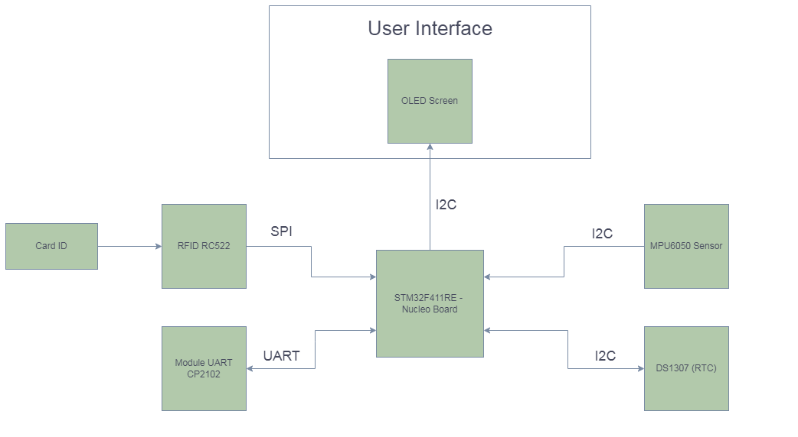
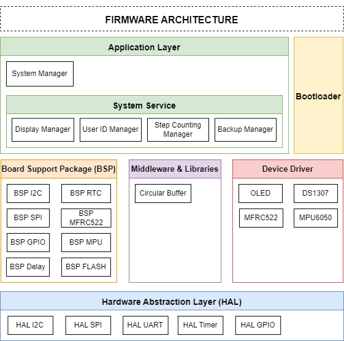
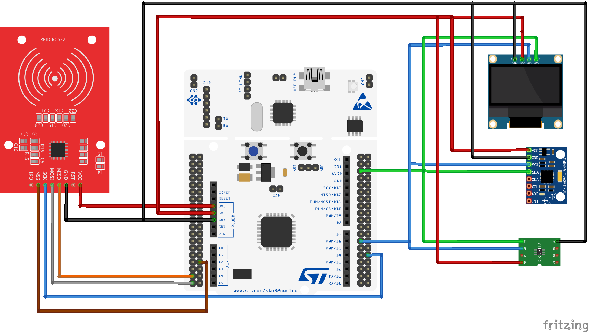

# Step Counting Device

### Describe

- This project focuses on developing a smart wearable device capable of counting the user's steps. It utilizes the STM32F411RE - Nucleo Board and a 3-axis gyro sensor for precise motion detection. 
- Additionally, we have incorporated the MFRC522 IC, allowing user identification through pre-set ID_Cards. Once a user scans their card and the system successfully recognizes one of the pre-configured IDs, the device initiates step counting. Scanning the card again stops the counting process, all while displaying information on an OLED screen.

### Features

1. **User ID Recognition**: Scan the ID card to be able to activate the step measurement function corresponding to the user.

2. **Step Counting**: Measure the user's steps.

3. **Real-time Clock Display**: Displays the time from the beginning of the pedometer to the end.

4. **User Name Display**: Display the user name corresponding to the ID card.

### Hardware Components

| **Module** | **Functionality** |
|:------|:-----|
| STM32F411RE - Nucleo Board  | The central processing unit|
| MPU6050 3-axis Gyro Sensor   | Responsible for detecting user motion |
| Module MFRC522 | Identify user ID|
| OLED Screen | Displays real-time clock information, user name and step counting |
| DS1307 (RTC) | Provide real-time clock information |

### Detailed Features

1. **User ID Recognition**

| **Number** | **Functionality** | **Note** |
|:------|:-----|:-----|
| 1  | Identification of the ID code on the ID card | Users can scan the ID card to start taking the step counting device | 

2. **Step Counting**

| **Number** | **Functionality** | **Note** |
|:------|:-----|:-----|
| 1  | Step count | The device relies on a 3-angle sensor to be able to detect the user's movement and thereby provide accurate step data. | 

3. **Real-time Clock Display**

| **Number** | **Functionality** | **Note** |
|:------|:-----|:-----|
| 1  | Display time | Displays the hour from the start of the pedometer to the end | 

4. **User Name Display**

| **Number** | **Functionality** | **Note** |
|:------|:-----|:-----|
| 1  | Display user's name | Displays the user name corresponding to the scanned ID number | 

### Block Diagram

### Firmware Architecture

### Schematic

### Contributors

- [Dung Nguyen]: Firmware Development
- [Loi Ho]: Firmware Development
- [Huy Le]: Firmware Development

